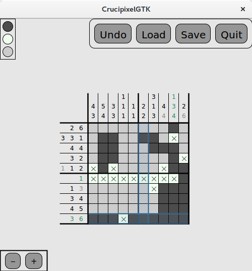

# Crucipixel #

First version of a game based on Crucipixels (also known as [Nonograms](https://en.wikipedia.org/wiki/Nonogram)) for Linux (tested on Ubuntu 16.04).

Python3.5 and PyGObject required; to install some basic schemes for playing, run `setup.sh` before starting the main application with `crucipixel` or `crucipixel.py`.
